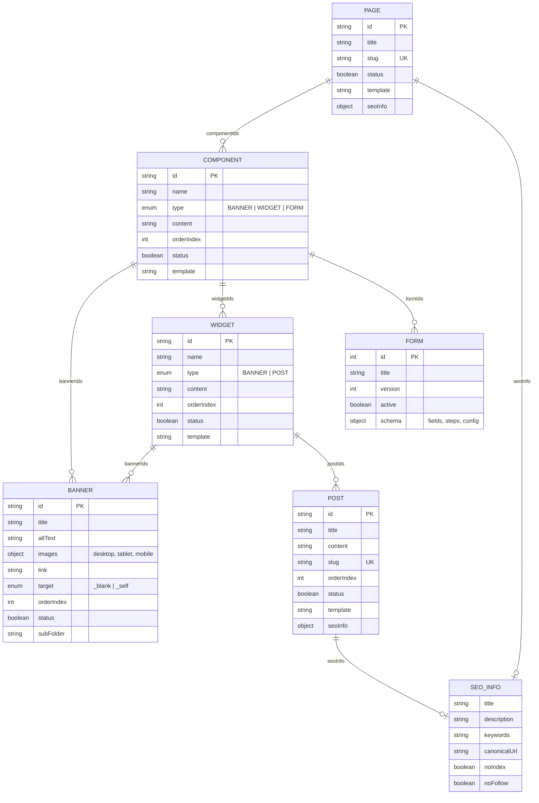
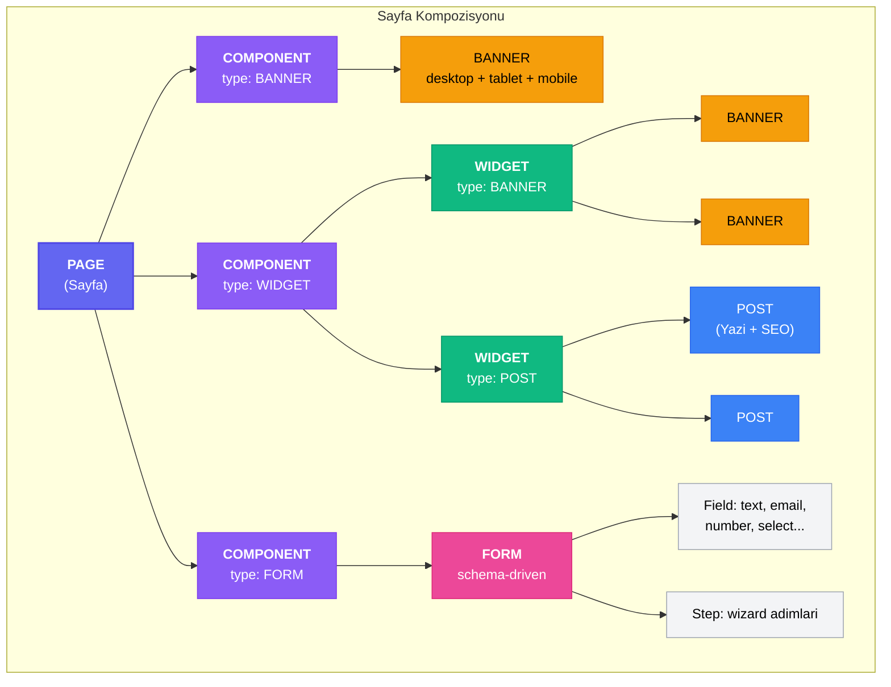
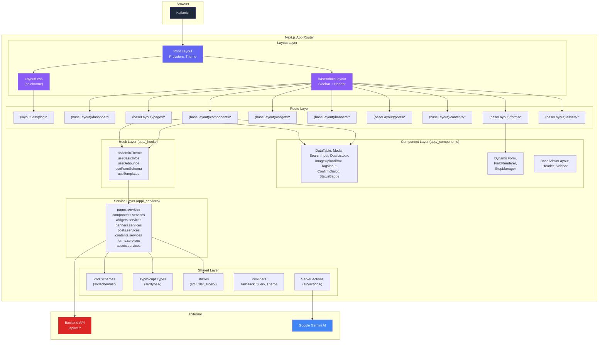
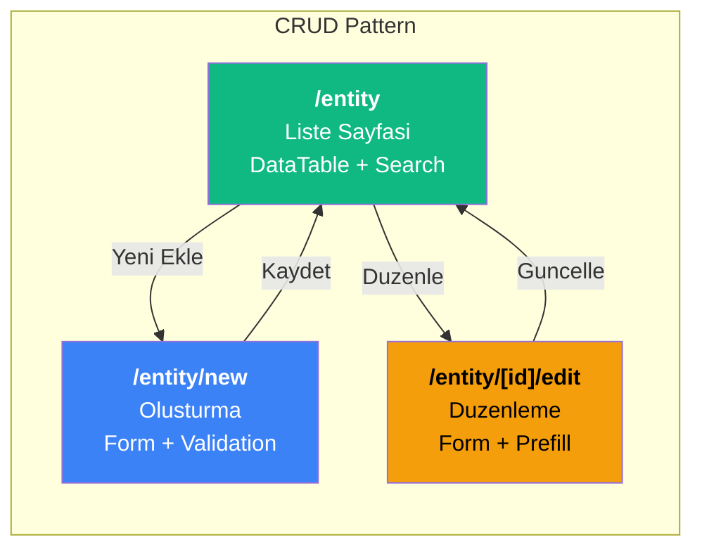
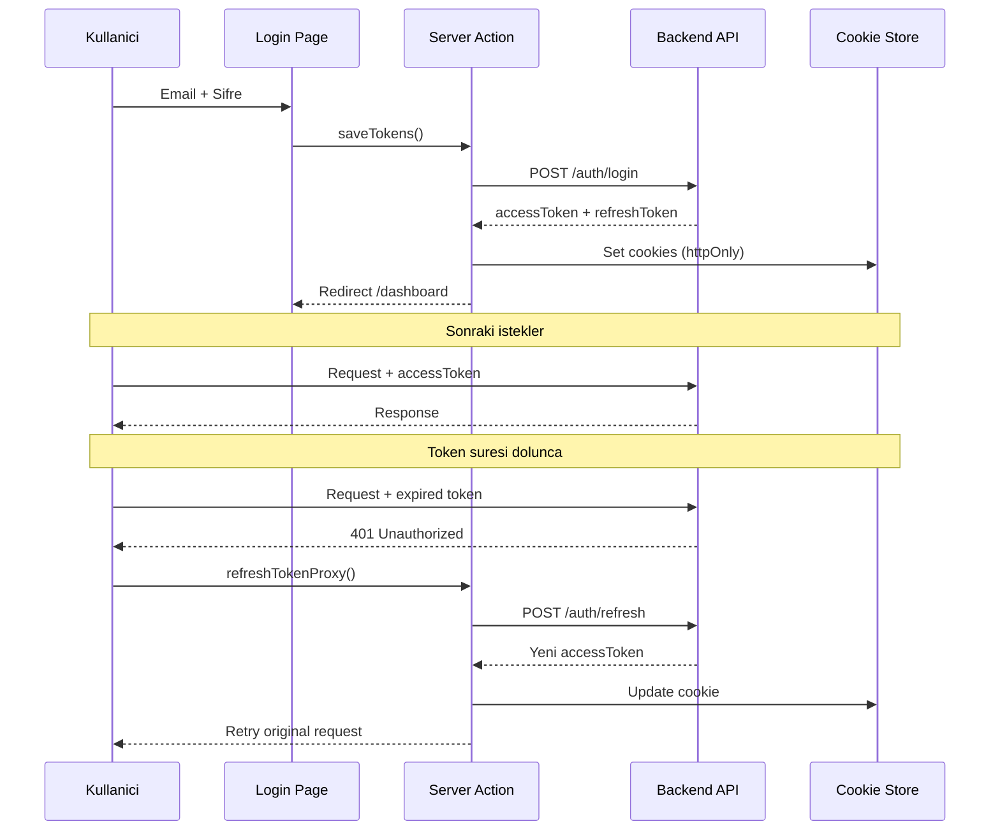
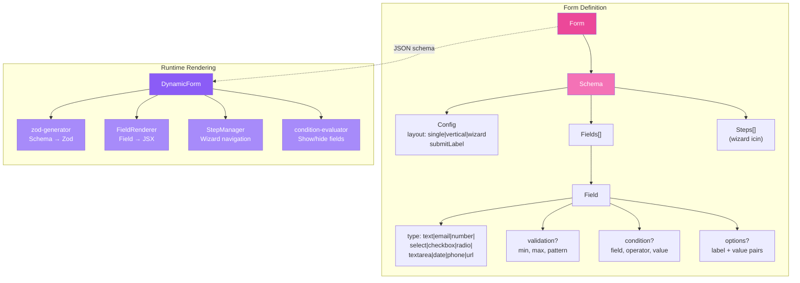

# Elly CMS — Mimari ve Schema Dokumantasyonu

Bu dokuman, Elly CMS Admin Panel'in mimari yapisi, entity iliskileri ve katman organizasyonunu gorsel olarak aciklar.

---

## 1. CMS Entity Iliskileri (Veri Modeli)

Asagidaki diagram, CMS'in temel veri modelini ve entity'ler arasi iliskileri gosterir.

---

## 2. Hiyerarsik Yapi Agaci (Composition Hierarchy)

Bu diagram, bir sayfanin nasil compose edildigini, hangi entity icine nelerin gelebilecegi kurallarini gosterir.

### Kural Ozeti

| Container              | Icerebilecegi Entity'ler | Aciklama                                        |
| ---------------------- | ------------------------ | ----------------------------------------------- |
| **Page**               | Component[]              | Bir sayfa N adet component icerir               |
| **Component (BANNER)** | Banner[]                 | Banner tipindeki component direkt banner icerir |
| **Component (WIDGET)** | Widget[]                 | Widget tipindeki component widget icerir        |
| **Component (FORM)**   | Form[]                   | Form tipindeki component form icerir            |
| **Widget (BANNER)**    | Banner[]                 | Banner tipindeki widget banner icerir           |
| **Widget (POST)**      | Post[]                   | Post tipindeki widget post icerir               |
| **Form**               | Field[], Step[]          | Schema-driven: alanlar ve adimlar               |
| **Banner**             | —                        | Yaprak node, alt entity icermez                 |
| **Post**               | —                        | Yaprak node, alt entity icermez                 |

---

## 3. Uygulama Katman Mimarisi

---

## 4. CRUD Sayfasi Yapisi (Her Entity Icin)

Her entity icin standart CRUD pattern uygulanir:

**Uygulandigi entity'ler:** Pages, Components, Widgets, Banners, Posts, Contents

**Farkli pattern:** Forms (`/forms/[id]` — ayri edit route yerine detay sayfasi)

---

## 5. Kimlik Dogrulama Akisi

---

## 6. Form Engine Yapisi

Form entity'si schema-driven bir yapidadir. Tum form tanimlamasi JSON olarak saklanir.

---

## 7. Dizin Sorumluluk Haritasi

| Dizin                   | Sorumluluk                           | Ornekler                           |
| ----------------------- | ------------------------------------ | ---------------------------------- |
| `src/app/(baseLayout)/` | Admin CRUD route'lari                | pages/, components/, widgets/      |
| `src/app/(layoutLess)/` | Chrome'suz sayfalar                  | login/                             |
| `src/app/_components/`  | Admin UI componentleri (colocated)   | DataTable, Modal, Sidebar          |
| `src/app/_services/`    | API servis fonksiyonlari (colocated) | pages.services.ts                  |
| `src/app/_hooks/`       | Admin-specific React hooks           | useFormSchema, useDebounce         |
| `src/app/_utils/`       | Admin yardimci fonksiyonlar          | zod-generator, condition-evaluator |
| `src/components/ui/`    | Shadcn UI primitives (global)        | Button, Input, Card                |
| `src/schemas/`          | Zod validation semalari              | page.ts, component.ts              |
| `src/types/`            | TypeScript tip tanimlari             | BaseResponse.ts, form.ts           |
| `src/actions/`          | Global server actions                | auth/logout, generate-article      |
| `src/services/`         | Global servisler                     | auth/refreshService                |
| `src/utils/`            | Genel utility fonksiyonlari          | fetcher, imageUrl                  |
| `src/lib/`              | Core library (env, security, AI)     | env.ts, gemini.ts, rate-limiter.ts |
| `src/providers/`        | React provider'lar                   | TanStack Query, Theme              |
| `src/proxy/`            | Token proxy islemleri                | refreshTokenProxy                  |
