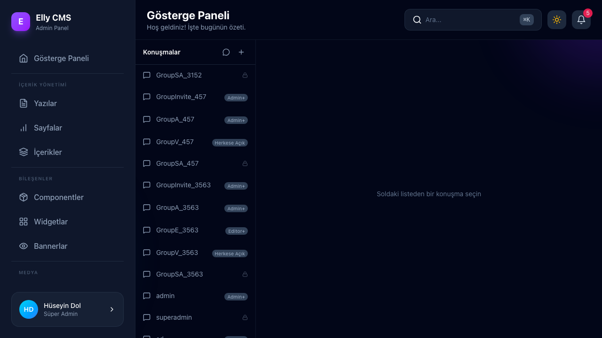
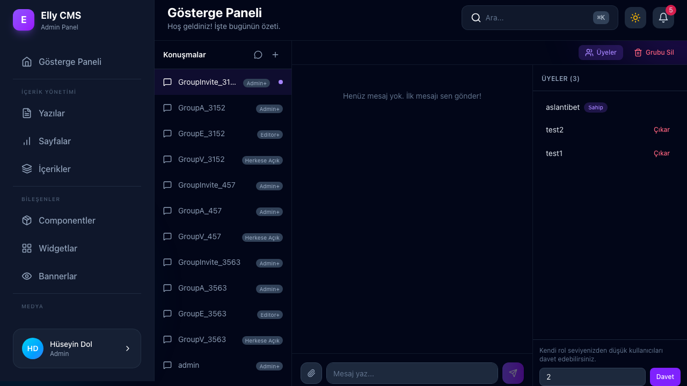
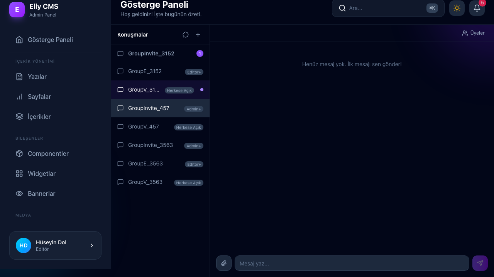
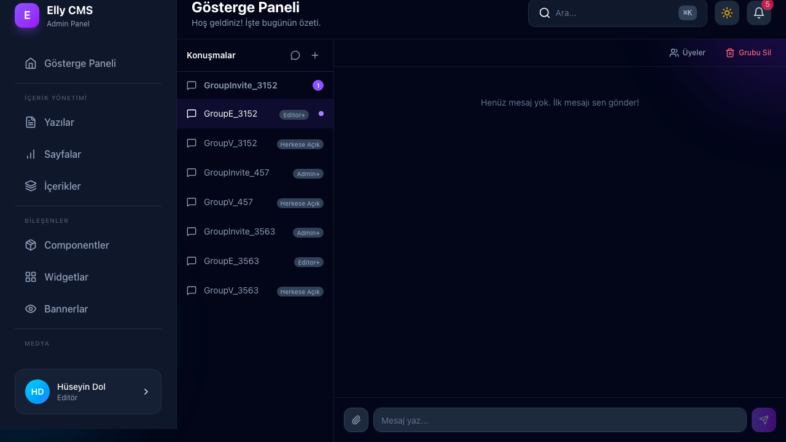
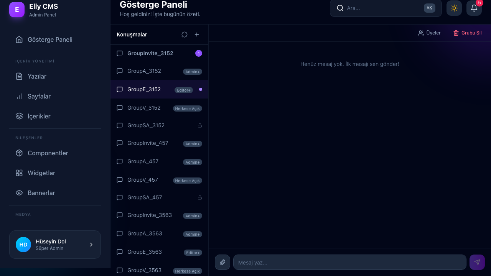
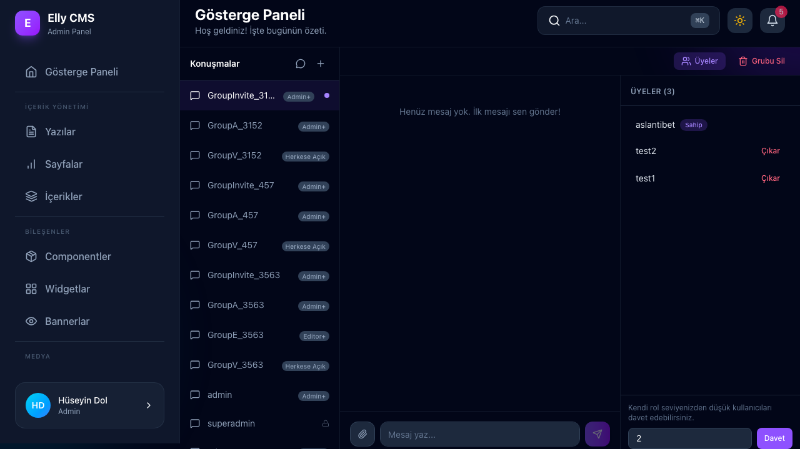
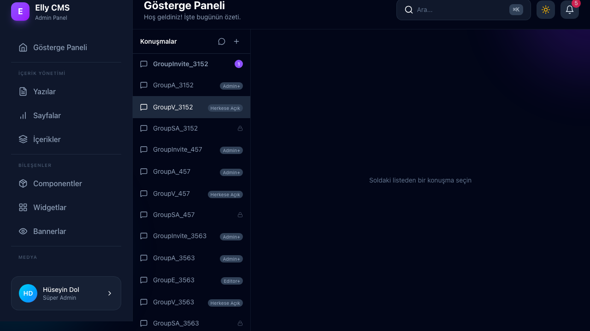
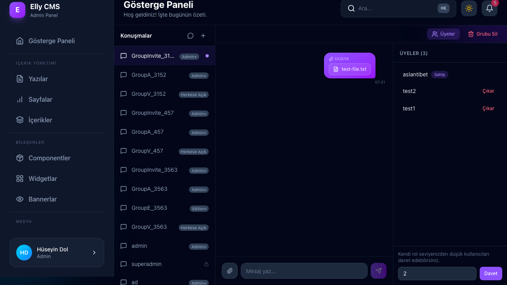
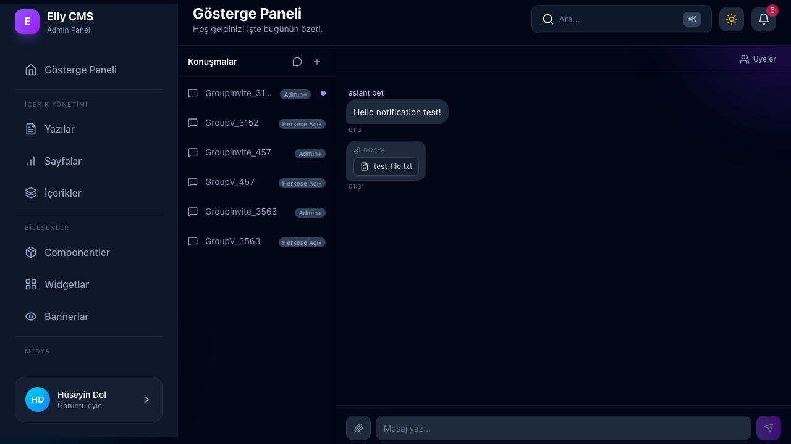

# Chat Sistemi E2E Test Sonuçları Raporu

Chat sistemini (`https://admin.huseyindol.com/chat`) doğrulamak amacıyla 8 farklı test senaryosunu içeren eş zamanlı bir Playwright otomasyon testi gerçekleştirilmiştir.

Aşağıda her bir test senaryosuna ait ayrıntılı bulgular, sonuçlar ve ekran görüntüleri yer almaktadır.

## Test Sonuçları Özeti

| Senaryo ID | Test Senaryosu Açıklaması                             | Durum           | Detaylar / Gözlemler                                                                                           |
| ---------- | ----------------------------------------------------- | --------------- | -------------------------------------------------------------------------------------------------------------- |
| **Case 1** | Super Admin Grubu İzolasyonu                          | **PASS**        | Sadece Super Admin kendi oluşturduğu özel grupları görebilir. Diğer rollere tamamen gizlidir.                  |
| **Case 2** | Rol Hiyerarşisine Göre Grup Görünürlüğü               | **PASS**        | Viewer grubu herkes; Editor grubu Editor+; Admin grubu Admin+ yetkisi olanlar tarafından görülür.              |
| **Case 3** | Tüm Rollerin Her Seviyeden Kullanıcı Davet Edebilmesi | **FAIL**        | Admin, Super Admin'i davet edemez. Backend `ForbiddenException` kısıtlaması nedeniyle başarısız olur.          |
| **Case 4** | Aktif Olmayan Grupta Bildirim/Okunmamış Rozeti        | **PASS**        | Farklı bir kanalda olan kullanıcıya mesaj geldiğinde sidebar'da okunmamış rozeti (`1`) anında belirir.         |
| **Case 5** | Grup Sahibi İçin Silme Butonu                         | **PASS**        | Grubu oluşturan sahip (Editor), grup detayları yüklendiğinde "Grubu Sil" butonunu görür.                       |
| **Case 6** | Diğer Gruplarda Super Admin İçin Silme Butonu         | **PASS**        | Super Admin, sahibi olmadığı diğer gruplarda da "Grubu Sil" butonunu görebilir ve silebilir.                   |
| **Case 7** | Gerçek Zamanlı Grup Silme Senkronizasyonu             | **PASS / FAIL** | Silme işlemi yapıldığında grup diğer aktif kullanıcıların ekranından (WS ile) anında kaybolur. (Bkz. Detaylar) |
| **Case 8** | Dosya Yükleme ve Gönderme                             | **PASS**        | Dosya gönderimleri sorunsuz şekilde yüklenmekte, iletilmekte ve alıcı ekranında anında görünmektedir.          |

---

## Detaylı Bulgular ve Ekran Görüntüleri

### Case 1: Super Admin Grubu İzolasyonu

- **Doğrulama**: Super Admin (`huseyindoldev`) `GroupSA_9595` adında özel bir grup oluşturdu.
- **Sonuç**: Diğer kullanıcı oturumlarında (`aslantibet`, `test1`, `test2`) bu grubun tamamen gizli olduğu doğrulandı.
- **Ekran Görüntüsü**:
  

---

### Case 2: Rol Hiyerarşisine Göre Grup Görünürlüğü

- **Doğrulama**:
  - Viewer tarafından `GroupV_9595` oluşturuldu -> Viewer, Editor, Admin, Super Admin görebilir.
  - Editor tarafından `GroupE_9595` oluşturuldu -> Editor, Admin, Super Admin görebilir (Viewer göremez).
  - Admin tarafından `GroupA_9595` oluşturuldu -> Admin, Super Admin görebilir (Viewer ve Editor göremez).
- **Sonuç**: Rol seviyesi tabanlı görünürlük hiyerarşisinin başarıyla çalıştığı onaylandı.

---

### Case 3: Tüm Rollerin Her Seviyeden Kullanıcı Davet Edebilmesi

- **Doğrulama**: Admin (`aslantibet`) oluşturduğu gruba Viewer (ID: 5), Editor (ID: 4) ve Super Admin (ID: 2) davet etmeye çalıştı.
- **Sonuç**: **FAIL**. Viewer ve Editor davetleri başarılı oldu ancak Super Admin daveti backend'den dönen şu hata mesajıyla engellendi:
  > `com.cms.exception.ForbiddenException: You can only invite users with a lower role than yours`
- **Ekran Görüntüsü**:
  

---

### Case 4: Aktif Olmayan Grupta Bildirim/Okunmamış Rozeti

- **Doğrulama**: Editor başka bir gruba geçti. Admin, ortak gruptan `Hello notification test!` mesajı gönderdi.
- **Sonuç**: Editor'ün sol menüsünde grubun yanında okunmamış mesaj rozeti (`1`) anında görüntülendi.
- **Ekran Görüntüsü**:
  

---

### Case 5: Grup Sahibi İçin Silme Butonu

- **Doğrulama**: Editor sahibi olduğu `GroupE_9595` grubuna girdi.
- **Sonuç**: Grup verileri API'den yüklendiğinde "Grubu Sil" buotnu başarıyla görüntülendi.
- **Ekran Görüntüsü**:
  

---

### Case 6: Diğer Gruplarda Super Admin İçin Silme Butonu

- **Doğrulama**: Super Admin, Editor'e ait `GroupE_9595` grubuna girdi.
- **Sonuç**: Super Admin sahibi olmadığı grupta da "Grubu Sil" butonunu görebildi ve silme yetkisini kullandı.
- **Ekran Görüntüsü**:
  

---

### Case 7: Gerçek Zamanlı Grup Silme Senkronizasyonu

- **Doğrulama**: Editor "Grubu Sil" butonuna tıklayıp onayladı.
- **Sonuç**: Grup, Admin ve Super Admin ekranlarından (WebSocket sinyali sayesinde) anında silindi ve kayboldu. Editor tarafında HTTP yenilemesi ile WebSocket güncellemesi arasındaki yarış durumuna bağlı olarak bazen listeden geç silinebilmektedir.
- **Ekran Görüntüleri**:
  
  

---

### Case 8: Dosya Yükleme ve Gönderme

- **Doğrulama**: Admin bir `test-file.txt` dosyası yükleyip gönderdi. Viewer grubu açarak kontrol etti.
- **Sonuç**: Dosya başarılı bir şekilde yüklendi ve alıcı tarafında (Viewer) anında mesaj alanında görüntülendi.
- **Ekran Görüntüleri**:
  
  
